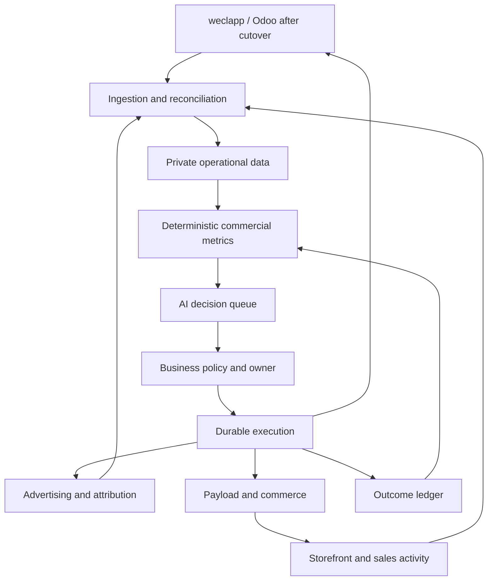

# Architecture and operating model

## Governing objective

Increase realised contribution after marketing and improve the use of inventory capital while preserving reliable fulfilment. Report cash separately: cash collected is not revenue earned, and reducing inventory is not automatically profit.

Use three top-level panels:
1. Trailing 28-day contribution after all advertising spend.
2. Excess inventory at cost, with its age and projected net cash recovery.
3. Fulfilment reliability: eligible orders fulfilled in full by their promised date.

Do not set percentage improvement targets before a baseline exists. Fixed overhead and taxes remain outside contribution and belong in the owner's full P&L view.

## System boundaries

| Layer | Responsibility | Proposed implementation |
|---|---|---|
| ERP authority | Products, purchase terms, stock movements, reservations, accepted orders, fulfilment and invoices | weclapp initially; Odoo after reconciliation and cutover |
| Customer surfaces | Existing Wix during transition; PV-Lager commerce; Solar Carport configurator | Existing Next.js projects; preserve customer URLs and leads |
| Editorial authority | Product descriptions, media, landing pages, approved claims and SEO | Payload with editor/publisher roles; ERP-owned fields remain read-only projections |
| Operational data | Source events, mappings, facts, quality checks, decisions and audit receipts | One business-owned EU Postgres database with restricted schemas |
| Jobs | Incremental imports, scheduled metrics, retries, reconciliation and approved dispatch | A durable worker plus Postgres outbox; n8n may schedule or orchestrate it |
| Commercial services | Pure arithmetic, forecast baseline, replenishment and offer constraints | Versioned functions/SQL; no LLM-generated numbers |
| AI specialists | Explain evidence, compare feasible options, prepare drafts and review outcomes | One orchestrator with bounded domain tools; independently evaluated responsibilities |
| Workbench | German-first action queue, category scorecards, product economics, cash calendar, decision history | Authenticated Next.js workbench on the chosen business host |
| Agent access | Scoped read tools and explicitly authorised command tools | MCP wraps the same service layer; never a separate source of business truth |

Start with one database and one worker. A vector index, separate warehouse, many autonomous runtimes and multiple new brands do not solve the initial evidence gap.

## Code and data placement

Continue implementation in pv-lager-agentic after recovering the deployed source. Proposed additions:
- apps/web: existing storefront; Payload integration and authenticated staff workbench.
- services/commercial-worker: imports, reconciliation and durable action execution.
- packages/commercial-core: metrics, constraints, canonical types and adapters.
- contracts: versioned data/action contracts.
- docs/commercial-os: this specification and its decisions.

These paths are proposed; only this specification and its contracts exist from this change.

The current repository is public. Commit code, generic schemas, tests and synthetic fixtures only. Keep customers, supplier terms, margins, stock quantities, quotes, exports, prompts containing business records, credentials and deployment settings in business-owned private services. A folder named private inside a public repository does not provide privacy.

PV-Lager and Solar Carport should share canonical product identifiers and commercial services. Keep distinct public experiences where they help customers. Do not duplicate inventory or make Aurevia another operational system.

## Authority and coherence

- ERP is authoritative for physical stock and business orders. Inventory truth comes from movements and warehouse counts, not site labels.
- Payload enriches products; it cannot silently overwrite authoritative price, availability or technical approval fields.
- Payment provider owns payment events; invoice and bank reconciliation establish collection. A successful checkout redirect does not establish payment.
- Analytics retains immutable source snapshots and derived metrics. Every value has a source, observation time and calculation version.
- Website order and ERP order share an external order key. Never count checkout, ERP order and invoice as three sales.
- Separate realised sales, open demand, expected demand and quotations. They are different populations.
- Separate quote price, realised historical contribution and future replacement-cost economics.

## Staff experience

Default screen: Heute. Show at most five highest-impact decisions, plus urgent operational exceptions. Each decision states action, reason, downside, supporting rows, source freshness, expected contribution, expected cash effect, due date and owner.

Drill-down surfaces:
- Produkte: units, watts, net sales, contribution, stock, age, coverage, channel and evidence.
- Einkauf: projected shortages, confirmed arrivals, supplier reliability, MOQ and cash timing.
- Chancen: quotes due, stalled opportunities, compatible bundles and repeat orders.
- Kampagnen: offer economics, attributable contribution, total spend, inventory support and test result.
- Lernen: decisions made, predictions, outcomes, overrides and updated playbooks.

Example questions the co-pilot should answer from governed tools:
- Welche Module liefern den höchsten Deckungsbeitrag je eingesetztem Lager-Euro?
- Was sollten wir diese Woche nachbestellen, und welche Bestellung kann warten?
- Welcher Bestand bindet Kapital, ohne bestätigte Nachfrage zu decken?
- Welche Kampagne erzeugt nach Versand und Retouren positiven Deckungsbeitrag?
- Welche Kundenanfragen können wir heute mit verfügbaren, kompatiblen Komponenten lösen?

No conversational answer can turn missing landed cost into zero, stale stock into current availability or a supplier claim into a verified specification.

## People and AI responsibilities

| Role | Accountable human | AI responsibility | Evidence of competence |
|---|---|---|---|
| Capital and commercial policy | Brother / business owner | Consolidate cash exposure and feasible decisions | Forecast versus actual cash timing; policy violations |
| Category ownership | Named employee per category | Explain assortment, margin and replenishment | Contribution, availability and ageing reviewed together |
| Sales and customer success | Named sales employee | Prioritise leads, draft suitable quotes and follow-ups | Quote turnaround, win/loss reasons and realised order contribution |
| Inventory and purchasing | Named operations employee | Flag discrepancies, draft POs and supplier comparisons | Count accuracy, supplier lead-time calibration and shortages |
| Campaign operations | Named employee | Prepare offers, assets, experiments and result analysis | Contribution after spend, fulfilment and attributable evidence |
| Technical operations | Frank initially | Observe jobs, errors and release quality | Import reliability, restore drills and reproducible deployments |

Names are deliberately unset until assigned by the business. An unassigned action stays visible in the owner's queue; it never disappears between agents.

Teach commercial judgment in the work itself:
- Each recommendation explains the driver and the rejected alternative in two sentences.
- Staff accept, edit or reject with a short reason.
- Record expected result before action; compare with outcome after the relevant sales/return window.
- Improve category playbooks from repeated evidence.
- Use team/category learning, not individual surveillance or gamified sales rankings.

Proposed cadence: ten-minute morning exception review; thirty-minute weekly buying/campaign allocation; monthly assortment and supplier review. Adapt after measuring real workload.

## Runtime and autonomy

The default mode is observe-and-draft. Routine arithmetic, internal summaries and drafts run automatically when connected. People approve purchase commitments, new campaign spending, public price changes and outbound messages until a scoped mandate exists.

A later mandate includes action types, account/warehouse/SKU scope, spend limits, price floors, cash reserve, allowed audience, validity period, responsible owner and stop conditions. Permission is evaluated at execution time. Existing mandates eliminate repetitive approvals within their scope.

A spending cap is aggregated across pending and executed actions. Splitting one purchase into smaller orders must not bypass it. Approved drafts become stale when price, stock, delivery date or policy changes materially.

LLMs propose; deterministic services recompute economics; the policy service checks authority; the worker executes and verifies the result. Unknown command outcomes are reconciled before retrying. Do not assume distributed exactly-once execution.

Safety checks are specific to commercial correctness: insufficient stock, missing costs, incompatible products, duplicate orders, expired supplier quotes, unclear tax/freight inputs and insufficient available capital.

## Odoo migration

Develop the weclapp adapter and common contracts now. Rehearse the Odoo adapter against the same canonical dataset. During shadow operation, Odoo reads and validates; it is not a competing writer.

Before cutover: map external IDs, product units, lots, BOMs, tax codes, price lists, customers, suppliers, open POs, open sales orders, reservations, returns, balances and payment allocations. Take a final delta, reconcile, disable the former write path and switch authority at a recorded boundary. Historical source IDs remain traceable.

Odoo 19 documents JSON-2, database-specific models and per-request transactions. Prefer an atomic server-side operation for dependent reservation/confirmation steps; verify hosted plan/API availability before purchase. MCP provider, deployment and permissions remain unverified. [Official Odoo documentation source](https://github.com/odoo/documentation/blob/19.0/content/developer/reference/external_api.rst)

Payload supports ecommerce collections and payment adapters; shipping and tax still require explicit implementation. [Payload ecommerce documentation](https://payloadcms.com/docs/ecommerce/overview)
