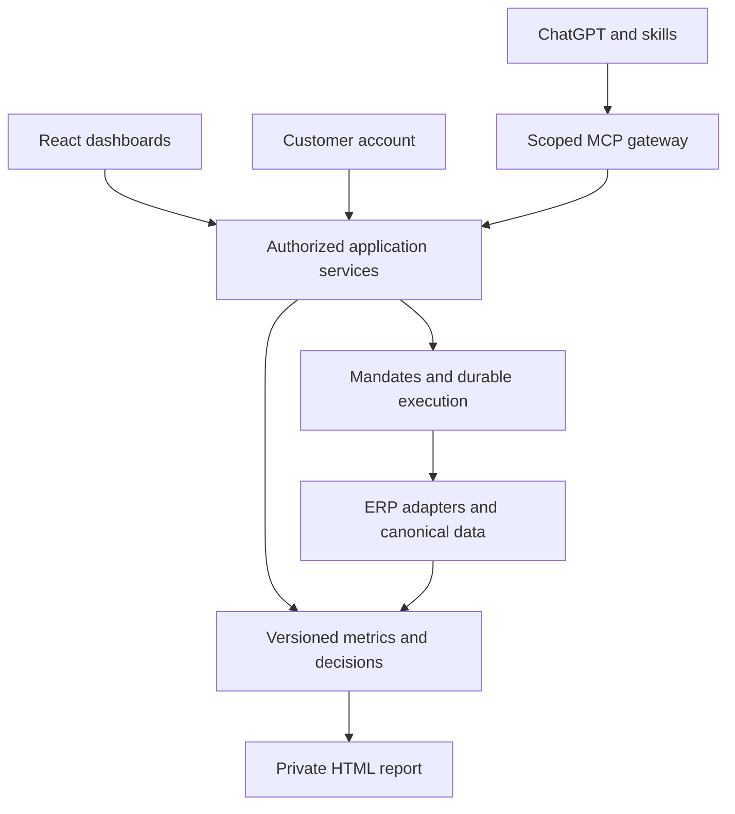

# Dashboard architecture: owned React application with portable reports

Recommended implementation decision · 2026-09-11 · Implementation pending

## Decision

Use the existing React/Next.js direction for the operational product. Deliver it initially as a managed, business-owned pilot with reusable tenant configuration. Keep Payload for content/admin functions, and build a focused staff workspace and customer account experience in the same application. Add self-contained HTML reports as exports from the same versioned data snapshot.

React is the implementation choice. SaaS describes operation and commercial delivery. Static HTML is a useful delivery format. None determines the others.

Do not purchase an additional dashboard SaaS for the pilot or build subscription billing before a second business validates the workflow. The differentiation is the evidence-to-decision-to-action loop. Retain deployable source, migrations, export contracts and documented operations so managed hosting is a choice rather than a data dependency.

## Application surfaces

| Surface | Proposed location | Purpose |
|---|---|---|
| Staff workspace | /app | Priorities, product economics, stock, buying, growth and owned actions |
| Customer account | /account | Own quotes/orders, documents, repeat purchases and customer pricing |
| Editorial/admin | /admin | Payload content, published enrichment and authorized administration |
| ChatGPT/Codex | Scoped MCP tools | Query and act on the same application records |
| Portable report | Private HTML/CSV export | Dated evidence for review, archiving and optional offline reading |

These are proposed routes, not deployed URLs. A role-aware staff shell serves owner and employees; do not build separate dashboard applications for each department. Customers receive a separate information model and field allowlist.

Payload's admin is built with React/Next.js and supports custom components and views. Use those capabilities for editorial/admin convenience; keep commercial components reusable so their business logic is not tied to the CMS UI. [Payload admin documentation](https://payloadcms.com/docs/admin/overview).

## First release and later modules

Ship one staff dashboard with a clear drill-through path before expanding the navigation.

| Module | Decision it supports | First useful display |
|---|---|---|
| Today | Where should the team act? | Three ranked decisions, accountable owner, freshness and blocked inputs |
| Products and contribution | Which modules deserve focus? | SKU/category rankings by units and contribution, cost coverage, channel comparison |
| Stock and buying | What should we buy or release? | Time-phased shortage risk, excess receipt lots, cash exposure and purchase drafts |
| Growth | Which promotion is worth testing? | Available-stock candidates, contribution floor, capped experiment and measured result |
| Customers and quotes | What must sales progress? | Quote stage, value, age, owner and next action |
| Data health | Which conclusions can be trusted? | Reconciliation variances, source lag, unknown cost and failed jobs |

The initial #8 slice is Today plus Products/Stock detail; Growth extends it when campaign data is available. Customer workflow belongs to #1. Data health is visible throughout, not hidden on an optional settings page.

Every commercial card follows: evidence → explanation → proposed action → authority/status → outcome. Show money, quantities and confidence limitations clearly. Do not fill empty states with invented activity or simulated live inventory.

## One data and execution contract

The browser, MCP gateway and report renderer consume the same calculated records. A dashboard does not have to remain open for refresh jobs, workflows or authorized agent actions to run. Skills guide tool use; the service owns calculation, authorization, persistence and execution.

For a pinned snapshot, dashboard and MCP requests with equivalent authorized scope must agree on metric values and decision IDs. Include reporting window, timezone, warehouse/category/channel filters, dataset version, calculation version, source extraction times and cost coverage. The server derives tenant/customer scope from verified membership.

Live values may legitimately change between calls: return the newer snapshot/version and explain the difference. Deep links retain permitted filters and decision IDs; opening them always rechecks access. Never carry credentials or authorization grants in a shareable link.

Use OAuth and server-side permission checks for personalized MCP data and actions; the plugin must not bypass the web application's policies. [OpenAI authentication documentation](https://developers.openai.com/plugins/build/auth).

## What static HTML can and cannot replace

A self-contained HTML/JS report can render tables, charts, local filtering and a dated snapshot without an ongoing application service. Bundle its assets for offline use, escape untrusted values and exclude credentials. An export containing private data remains private after download and cannot be centrally revoked; offer an authenticated hosted report for revocable access.

A statically hosted frontend can also call a live API. That is a valid application deployment, but the API still needs hosting, identity, credential protection, synchronization and shared write semantics. It does not eliminate the backend.

Next.js supports static exports and client-side fetching, while request-dependent server features require server infrastructure. Keep the main Payload/auth/transaction application server-capable; build portable reports through a separate export path rather than setting the entire application to static export. [Next.js static export documentation](https://nextjs.org/docs/app/guides/static-exports).

Use HTML for reports, onboarding examples and a possible standalone CSV-analysis edition. Do not build a second independent margin engine in that edition: share tested metric definitions/calculation code, label source dates, and do not imply live sync.

## Operation, ownership and commercial packaging

Start with a modular application plus a durable worker and private database. Vercel is the pilot's existing hosting direction; avoid choosing an additional vendor solely to display charts. A separate worker runtime for long jobs does not require splitting the product into microservices.

Keep production data/accounts under the business and delegate technical access. A dedicated first-business deployment may use the same code and tenant contracts later used for shared hosting. Prove unrelated-business isolation before pooling production customers.

Recommended commercial structure:
- A perpetual versioned software/template entitlement can cover source, skills or a standalone report tool.
- Ongoing hosting, ERP synchronization, backups, support and model usage need recurring funding or explicit customer-paid infrastructure.
- Offer self-hosted operation with a documented responsibility boundary.
- Do not promise unlimited lifetime managed AI or live integrations against a one-time payment.

This is a packaging recommendation, not a price quote or a new billing implementation.

## Acceptance gates

- #8: Responsive staff dashboard with real loading, empty, denied, stale and failed-source states; keyboard navigation; deliberate mobile table/card behavior; no whole-page horizontal overflow.
- #8: On a fixed authorized fixture, dashboard and service response match the same metric definitions, filters, period and data version; define the report snapshot contract.
- Later report slice: the HTML/CSV renderer preserves that contract, scope and values. Report rendering is outside #8's core completion gate and must not block #9.
- #8: Unknown cost never becomes zero or a profitable rank; data health and provenance can be opened from each decision.
- #1: Customer account shows only its own prices/quotes/orders and no internal cost/margin data.
- #9: Scoped MCP response agrees with the dashboard for a pinned snapshot; role-denied fields stay absent across both.
- #10: Actions use the shared mandate/outbox service and survive retries without duplicate external effects.
- #11: A second synthetic tenant with overlapping identifiers works through configuration without leaking dashboards, reports or records.

HTML/report generation is not allowed to delay the first useful staff view. Live ERP reconciliation and working server authorization remain prerequisites for claiming a production dashboard, even when the UI looks finished.
