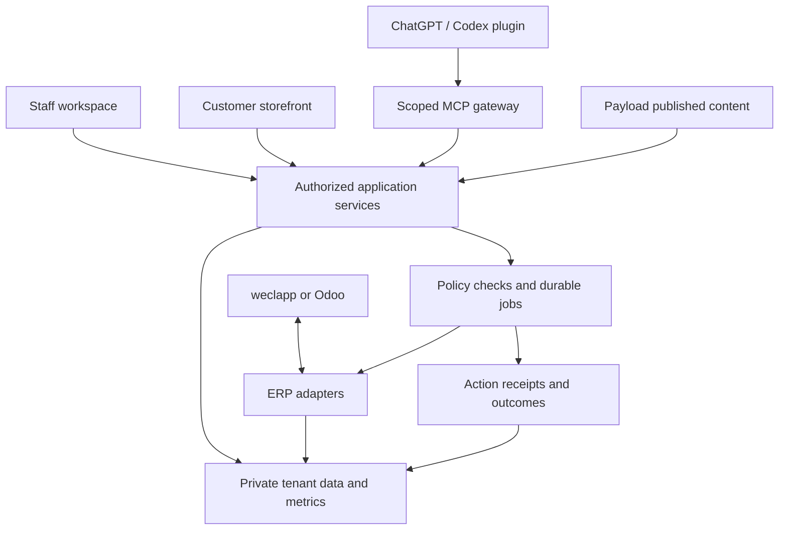

# Solar Commercial OS — reusable product architecture

Design proposal · 2026-09-11 · PV-Lager / RIAL Energy is the first pilot

## Product boundary

Build one maintained product for solar distributors and similar businesses. Each business receives its own configuration, data scope, staff roles, customer accounts, catalog and ERP adapter. “Genius” can be the assistant experience; Solar Commercial OS is the underlying product. Neither name implies a deployed service.

Start with one business and prove a second synthetic tenant. Add a real second pilot after staff value and onboarding are demonstrated. Do not promise that every industry can reuse solar-specific purchasing or compatibility rules unchanged.

| Layer | Shared capability | Business-specific configuration |
|---|---|---|
| Staff workspace | Stock/economics evidence, decisions, approvals, outcome reviews | Categories, warehouses, margin floors, owner roles |
| Customer experience | Catalog, verified comparisons, quote/cart, own-order status | Brand, product range, customer prices, delivery rules |
| ChatGPT/Codex plugin | Skills and scoped tools over the same services | Authenticated memberships and allowed actions |
| Content | Payload editorial models and publishing | Pages, product enrichment, documents, locale |
| Commerce | Quote calculation, pricing access, durable ERP handoff | Tax/price basis, pack units, freight, payment terms |
| Canonical data | Versioned product/stock/sales/purchase contracts | weclapp, Odoo, export mappings and source IDs |
| Operations | Audit, outbox, retries, reconciliation, monitoring | Freshness SLAs, escalation owners, mandates |

## Shared topology

The MCP gateway translates scoped tool calls into application operations. It does not calculate business truth or provide an unrestricted ERP shell. The website and plugin reuse services, authorization and execution receipts.

## Authority and isolation

An organization is the tenant boundary. A user may hold memberships in multiple organizations; select only among memberships verified by the server. A customer account belongs to one tenant and may have multiple authorized contacts. Dealer/installer customers remain customer accounts unless separately granted a staff membership.

Public catalog queries use a published tenant storefront mapping. Authenticated actions derive tenant, role and customer ownership from trusted identity and membership. Caller-supplied object IDs filter records only after authorization. Do not use the model's role prompt as an access check.

Enforce tenant boundaries in database access, API responses, background jobs, cache keys, object storage, exports, observability and search/retrieval. Include tenant and customer in idempotency scopes where appropriate. Privileged service accounts require explicit narrow service authorization and audit. Never create a shared retrieval index that exposes other businesses' private documents.

| Role | Typical access | Consequential authority |
|---|---|---|
| Business owner | Own-business economics, policies, roles | Sets mandates within account authority |
| Manager/category owner | Evidence and decision queue | Approves only delegated actions |
| Purchasing | Costs, suppliers, stock, replenishment | Purchases only within mandate |
| Sales | Customer quotes, permitted stock/prices | Quote/order actions within role |
| Marketing | Approved promotion candidates and budgets | Campaign changes within mandate |
| Customer/installer | Published catalog, own prices/quotes/orders | Own quote or checkout actions |
| Technical support | Operational metadata by default | Time-bound audited support access |

Do not expose costs, internal margins, supplier terms, unpublished content or another customer's records through customer tools. Avoid putting commercial evidence in this public repository; store private evidence and link only a nonsensitive reference from tickets.

## Data and transaction ownership

- ERP: authoritative commercial inventory, committed orders, procurement and financial records.
- Payload: editorial content, published product enrichment and technical document publishing. Editorial changes must not overwrite ERP price/stock.
- Commerce services: access-aware price/quote calculation and customer workflow; persist quote states and durable handoffs. An accepted quote, ERP order, reservation and payment are separate states.
- Private canonical Postgres: scoped analytical facts, source identifiers, calculated metrics, decision and audit records. It must preserve extraction timestamps and quality flags.
- Worker/outbox: long-running sync, handoff and execution with idempotency and receipts.
- Model: explanation, drafting and tool selection based on scoped evidence. Deterministic services calculate economics and enforce mandates.

Begin with a quote-first journey if payment/shipping/tax responsibility is unresolved. A full checkout needs an explicit payment provider, invoice owner, tax/price basis, pack units, freight rules, cancellation/refund handling and ERP reservation semantics. Record that decision in #1 before enabling live checkout; do not let the CMS become a second financial ledger.

## Workflows that teach entrepreneurship

1. **Morning priorities:** refresh sources → reconcile → compute metrics → rank three decisions → staff owns each choice. Show what changed and how reliable the inputs are.
2. **Buy next:** estimate demand through stockouts → time-phase inbound and lead time → apply MOQ/cash limits → prepare a purchase → execute only under applicable authority → reconcile receipt.
3. **Release excess stock:** inspect sellable lot age and contribution → compare bundle, discount, targeted ads and supplier return → choose a bounded experiment → measure contribution and cash recovered. High inventory alone never proves an ad is worthwhile.
4. **Customer buying:** understand requirements → retrieve verified products → price an exact quantity → persist quote → hand off durably → return status → track fulfillment. Technical uncertainty is escalated with evidence.
5. **Outcome learning:** compare prediction and result → explain one driver → update a documented rule/assumption through its owner. Distinguish association from proven incremental ad lift.

Automate refresh, arithmetic, exception detection, briefs and drafts first. Expand execution through measured mandates. The business outcome is better contribution, cash use, fulfillment and repeat business; generated content volume is not a success metric.

## Parallel work and migration order

After source recovery, content/UX work and synthetic adapter/authorization work can proceed alongside each other. Read-only ERP/export intelligence does not require a new website. Live quotes require authoritative data and durable handoff. Live AI actions require the same authorization and execution service.

weclapp is a replaceable adapter now. Odoo migration is a later controlled cutover: map identifiers, reconcile opening balances and open transactions, shadow-read/compare, freeze affected writes, switch one authoritative writer, verify, and retain recovery steps. An Odoo MCP server is optional tool access after authentication and scope evaluation; it does not replace data reconciliation or migration. Do not run two uncoordinated ERP writers.

## Commercial and operational ownership

Prefer business-owned production accounts, billing, domains, payment systems and data. Frank can maintain the shared software and hold delegated technical access. Paying temporarily does not require permanent personal ownership; document any temporary arrangement and an exit/handover path.

PV-Lager, SolarCarport and Aurevia can share the backend/product code while preserving their distinct wholesale, project-enquiry and consumer experiences. Avoid forcing all three into one frontend or transferring all assets before the pilot proves useful.

The pilot's hosting/data isolation choice should be explicit: a dedicated business deployment can reduce initial operational coupling while using the same code/config contracts. A shared multi-tenant deployment requires the full isolation tests before serving unrelated businesses.

## Acceptance and limits

Technical readiness: reproducible build; reconciled data; traceable calculations; one durable quote; negative tenant/customer tests; replay-safe controlled action; second synthetic tenant without a fork. These are measurable gates in [the backlog](tracking.md).

Business readiness: named operators, baseline/observation period, accepted costs/metrics and authority, staff/customer review, then a real second pilot. Revenue uplift and reduced stock are hypotheses until measured. This proposal and plugin package do not establish a live ERP connection, production product or marketplace publication.
