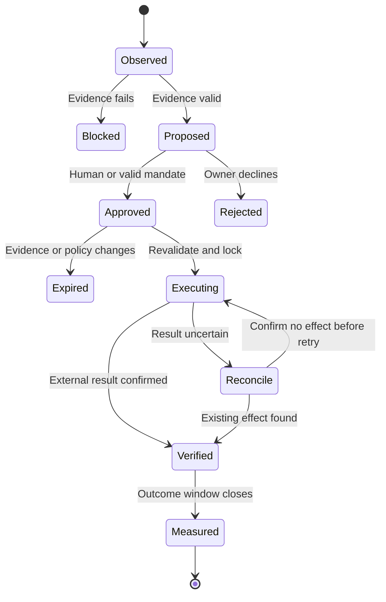

# Commercial workflows

Proposed workflows. None is activated by this specification. Workflow schedules are design choices, not reminder/automation requests executed in ChatGPT.

## Shared execution contract

Every workflow carries a tenant ID, source evidence, observation time, calculation/policy version and unique business key. Its states are:

Retries never create a new commercial decision. Persist approval and action attempt before external writes. Read back the external object/status after writing. If the provider lacks idempotency keys, use a stable external reference, local action lock and reconciliation before retry.

Store a failed action with owner and deadline. A dashboard may show delivered only after delivery is confirmed; a logged event is not delivery.

## W01 — Reliable source refresh and daily brief

Trigger: scheduled source refresh; recompute affected metrics after source changes; morning summary in Europe/Berlin.

Inputs: ERP changes, inventory snapshots, invoices/credits, arrivals, supplier terms, ads, open quotes and fulfilment.

Steps:
1. Import paginated data with durable cursors, overlap windows and duplicate control.
2. Retain source rows privately; normalise SKUs, units, currencies and document links.
3. Reconcile balances and totals; quarantine conflicting records.
4. Refresh metrics and compare with prior windows using matching definitions.
5. Rank business decisions by feasible expected benefit and urgency. Keep stock/lead failures in a separate exception lane.
6. Present up to five actions with source freshness, rationale and owner.

Output: morning decision queue and data-quality receipt.
Owner: operations employee; unresolved quality problems to technical operator.
Metric: data freshness, reconciliation coverage and time from detected issue to ownership.
Failure: preserve last successful observation with its true date; suppress dependent execution rather than displaying a fresh false snapshot.

## W02 — Product/category intelligence

Trigger: daily invoice/return refresh; weekly category review.

Inputs: sales, landed COGS, freight/payment/return costs, stock exposure, segment/channel and concentration.

Steps:
1. Rank units, watts, net revenue, gross profit euros, contribution euros and inventory return separately.
2. Explain price/volume/mix/cost changes using deterministic decomposition.
3. Flag frequent sellers with weak contribution, strong-margin products with weak demand, and high-return/problem products.
4. Identify verified component attach opportunities and repeated lost-sale reasons.
5. Prepare a category-owner review: continue, grow, repair, replenish, reduce or exit.

Output: category scorecard and a small assortment decision list.
Owner: category employee; supplier commitments to purchasing.
Metric: category contribution, cost coverage and fulfilment reliability.
Failure: unknown costs exclude profit ranking and disclose the excluded revenue share.

## W03 — Buy next and avoid shortages

Trigger: projected stock crosses its agreed safety threshold before next feasible replenishment.

Inputs: time-phased inventory, reservations, firm orders, residual forecast, confirmed POs, lead-time range, supplier quote, pack/MOQ, cash schedule.

Steps:
1. Verify the shortage is real rather than stale stock, duplicate demand or a delayed import.
2. Compare no action, transfer, approved substitute, expedite and replenishment.
3. Calculate feasible quantities under cash, MOQ, pack size, capacity and maximum-coverage constraints.
4. Compare supplier offers on landed cost, reliability, return terms and payment timing.
5. Draft one purchase order and a short explanation of the opportunity cost.
6. Under approval/mandate, create the PO once; reconcile acknowledgement and update expected receipts.
7. Compare promised and actual delivery; refine lead-time assumptions.

Output: purchase recommendation with shortage date, confidence, downside scenario, cash due dates and expected order contribution supported.
Owner: purchasing employee; owner decides exceptional capital allocation.
Metric: avoidable stockouts, excess bought and supplier delivery calibration.
Failure: missing cost, stock or supplier-date evidence blocks purchase dispatch; offers expire explicitly.

## W04 — Excess inventory to cash recovery

Trigger: excess coverage, material lot age or verified obsolescence risk.

Inputs: actual held quantities/costs, project reservations, demand, approved compatibility, supplier return terms, attainable prices and channel costs.

Steps:
1. Diagnose low exposure, poor offer, unsuitable specification, excessive price, seasonality, missing accessories or genuine weak demand.
2. Exclude protected project/service inventory.
3. Compare supplier return/exchange, installer pallet offer, compatible bundle, local pickup campaign, targeted promotion and managed markdown.
4. Estimate net cash recovery and book contribution separately; include cannibalisation and fulfilment capacity.
5. Prefer exposure/offer improvements before a blanket discount when evidence supports them.
6. Prepare the selected offer and bounded test; require a recorded exception for liquidation below the normal floor.
7. Measure held inventory reduction, incremental contribution and actual cash collected.

Output: SKU/lot-specific clearance proposal with eligibility, channel, quantity ceiling and expiry.
Owner: category employee; owner approves exceptional losses.
Metric: excess value reduced, net cash recovery, contribution sacrificed and protected stock availability.
Failure: do not automatically advertise every old product; unknown age/demand or technical suitability becomes a review task.

## W05 — Profitable campaign production and learning

Trigger: an approved commercial opportunity, launch, seasonal signal or matured campaign review.

Inputs: verified product data/images, saleable stock, actual landing page, economics, approved spend envelope, audience/channel mandate, attribution and conversion lag.

Steps:
1. Choose the objective: qualified quote, component order, installer pallet order or clearance.
2. Derive a feasible offer: price, compatible bundle, pickup/delivery promise and preserved contribution.
3. Draft German copy, creative variants, landing-page blocks and a product-feed update in Payload staging.
4. Check source claims, actual product appearance, feed/checkout price consistency and stock support.
5. Reuse verified product media; generated scenes must not misrepresent the purchased hardware or certificates.
6. Employee approves the initial campaign and spend; later bounded changes may use a valid mandate.
7. Record campaign/offer/order identifiers, consent basis and attribution method.
8. Reconcile all spend to won/paid/fulfilled orders and returns. Make bid/creative changes at an appropriate conversion-lag cadence.
9. Stop or reduce a campaign when policy limits, availability or reliable economics fail; reconcile budget changes.

Suggested channel hypotheses to test:
- Search/Shopping for standard, comparable, in-stock products with viable freight economics.
- Geographic search and proof-led landing pages for carports and installation enquiries.
- Approved repeat-installer outreach and pallet/bundle offers for B2B demand.
- Social proof and retargeting where audience permissions and measured unit economics justify it.
- Existing marketplace channels only through supported, authorised operations.

These are test hypotheses, not measured winning channels. Start one primary campaign with one clear conversion event before spreading the budget.

Output: campaign kit, draft/published status receipt and experiment ledger.
Owner: commercial employee; business owner sets total capital envelope.
Metric: matured contribution after spend; qualified-to-won conversion; fulfilment guardrail.
Failure: unknown attribution stays unknown; no ROAS-only scaling, uncontrolled budget increases or new campaign launch without authority.

Google supports transaction-specific values and offline conversion ingestion. Choose a supported integration and conversion definition after verifying the account; keep contribution calculations internal unless an explicit value-based bidding configuration is approved. Do not send a raw lead and the eventual order as two equivalent primary sales.
Sources: [dynamic values](https://support.google.com/google-ads/answer/6095947), [offline conversions](https://developers.google.com/google-ads/api/docs/conversions/upload-offline).

## W06 — Quote-to-order sales co-pilot

Trigger: enquiry, abandoned quote, promised callback or customer request.

Inputs: customer needs, project constraints, approved BOM, available stock, price rules, delivery options, communication permission and history.

Steps:
1. Persist enquiry and ownership before acknowledging receipt.
2. Validate required information; prepare focused missing-detail questions.
3. Build feasible good/better/best options only when technically validated.
4. Recompute all commercial prices server-side, with shipping/tax rules and validity.
5. Draft quote and follow-up; explain customer value and what remains to be confirmed.
6. Employee sends, or an approved workflow sends within a recorded communication mandate.
7. Capture win/loss reasons and connect accepted quote to the authoritative ERP order.
8. Track fulfilment and follow up on issues; return lessons to category decisions.

Output: owned opportunity, quote draft, callback task and order link.
Owner: sales employee.
Metric: first useful response time, quote turnaround, realised contribution and missed promises.
Failure: do not auto-certify structural suitability, installation compliance or product compatibility from prose alone. Route to a qualified reviewer.

## W07 — Supplier and assortment development

Trigger: weekly review or a recurring lost-sale/supplier-failure pattern.

Inputs: category contribution, customer demand, quote loss reasons, supplier history, documented prices and product compatibility.

Steps:
1. Identify demand that current assortment cannot fulfil and duplicate SKUs fragmenting inventory.
2. Compare stronger supplier terms, a compatible substitution or a small category pilot.
3. Estimate required working capital, expected gross/contribution euros, downside holding cost and exit route.
4. Draft a supplier enquiry or negotiation brief; sending and commitments require authority.
5. Pilot one constrained assortment change and evaluate after its relevant buying cycle.
6. Promote or stop based on measured demand and contribution.

Output: supplier negotiation/pilot card.
Owner: category employee with purchasing; owner sponsors new categories.
Metric: improved realised landed cost/terms, dependable availability and pilot capital returned.
Failure: interest, clicks and generated market narratives are not purchase demand.

## W08 — Entrepreneurial learning and capital review

Trigger: weekly decision review and monthly assortment/cash review.

Inputs: decision history, predicted ranges, actual results, overrides, cash commitments and customer experience.

Steps:
1. Review the largest three decisions, not every chart.
2. Compare expected versus actual contribution, cash timing and inventory position.
3. Distinguish execution failure, wrong assumptions, external change and measurement gaps.
4. Record a short reusable rule and its evidence.
5. Decide next week's category/campaign allocation under a shared cash envelope.
6. Increase AI authority only for workflows with reliable outcomes and low correction rates; revoke scoped authority when conditions change.

Output: updated commercial playbook and explicit policy revision.
Owner: brother with category owners.
Metric: measured decisions, calibrated forecasts, useful staff time saved and fewer repeated exceptions.
Failure: do not reward clicks, AI activity volume, superficial recommendations or an employee's acceptance rate.

## AI responsibilities and evaluation

| Specialist | Tools / output | Evaluation |
|---|---|---|
| Data steward | Reconciliation and provenance queries | Missing/duplicate detection; correct refusal to invent values |
| Category analyst | Metric queries and product scorecards | Arithmetic provenance; price/volume/mix explanation fidelity |
| Buyer | Planning simulator and supplier comparisons | Feasible quantities, no double-counted demand, downside calibration |
| Offer planner | Excess analysis and validated BOM/offer data | Positive economics or clearly approved liquidation loss; technical fit |
| Campaign operator | Approved media/claims, experiment and draft tools | Claim fidelity, budget compliance and contribution evidence |
| Sales co-pilot | CRM/quote draft and availability services | Correct delivery promises, ownership and useful follow-up |
| Operations reviewer | Action/outcome ledger and quality metrics | Duplicate prevention, failure recovery and learned rule quality |

These are logical responsibilities, not seven mandatory always-on model instances. Run the smallest model/tool workflow that satisfies measured quality; escalate ambiguous planning to stronger reasoning and human review.
